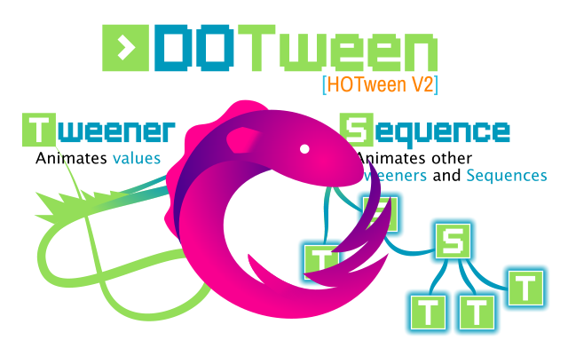

# Unity DoTweenRx

<p align="center">
  
</p>

DoTween Rx extension package

### Unity Package Installation

Add to your project manifiest by path [%UnityProject%]/Packages/manifiest.json these lines:

```json
{
  "scopedRegistries": [
    {
      "name": "Unity",
      "url": "https://packages.unity.com",
      "scopes": [
        "com.unity"
      ]
    },
    {
      "name": "UniGame",
      "url": "http://packages.unigame.pro:4873/",
      "scopes": [
        "com.unigame"
      ]
    }
  ],
}
```
Open window Package Manager in Unity and install DoTweenRx Package

## How to Use

### DOLocalMove

```csharp

  this.transform.DOLocalMove(new Vector3(-200f, 0f, 0f), 1f)
      .OnCompleteAsObservable()
      .Subscribe(_ => 
      {
          Debug.Log("Completed.");
      })
      .AddTo(this);

```

```csharp

  var sequence = DOTween.Sequence();
      sequence.Append(anim.tween);
      sequence.PlayAsObservable().Subscribe(_ =>
      {
          Debug.Log("Complete Sequence.");
      })
      .AddTo(this);

```

### Observable.WhenAll

```csharp

  [SerializeField] DOTweenAnimation[] animations;

  void Start()
  {
      Observable.WhenAll(animations.Select(x => x.DOPlayAsObservable(rewind)))
      .Subscribe(x =>
      {
          Debug.Log("Completed.");
      });
      .AddTo(this);
  }

```

### AsyncMessageBroker

``` csharp

  public class AnimEvent {}

  public class SampleReceiver : MonoBehaviour
  {
      [SerializeField] DOTweenAnimation anim;

      void Awake()
      {
          AsyncMessageBroker.Default.Subscribe<AnimEvent>(_ =>
              bool rewind = true;
              anim.DOPlayByIdAsObservable("in", rewind)
          ).AddTo(this);
      }
  }


  public class SamplePublisher : MonoBehaviour
  {
      void Start()
      {
          AsyncMessageBroker.Default.PublishAsync<AnimEvent>(new AnimEvent()).Subscribe(_ =>
          {
              Debug.Log("Publish Completed.");
          });
      }
  }

```
